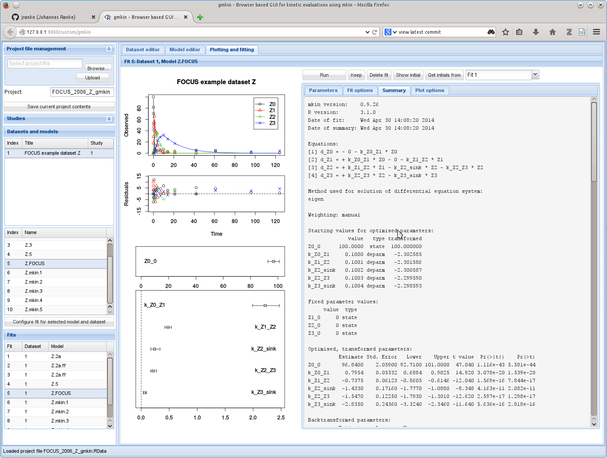

# mkin

The R package **mkin** provides calculation routines for the analysis of
chemical degradation data, including <b>m</b>ulticompartment <b>kin</b>etics as
needed for modelling the formation and decline of transformation products, or
if several compartments are involved.

## Installation

You can install the latest released version from 
[CRAN](http://cran.r-project.org/package=mkin) from within R:

```s
install.packages('mkin')
```

A development version is usually available from [R-Forge](http://r-forge.r-project.org/R/?group_id=615):

```s
install.packages('mkin', repos = 'http://r-forge.r-project.org')
```

If R-Forge is lacking behind or if you prefer, you can install directly from
github using the `devtools` package:

```s
require(devtools)
install_github("mkin", "jranke")
```

## Background

In the regulatory evaluation of chemical substances like plant protection
products (pesticides), biocides and other chemicals, degradation data play an
important role. For the evaluation of pesticide degradation experiments, 
detailed guidance and helpful tools have been developed as detailed in
'Credits and historical remarks' below.

## Usage

A very simple usage example would be

    library("mkin")
    example_data = data.frame(
      name = rep("parent", 9),
      time = c(0, 1, 3, 7, 14, 28, 63, 91, 119),
      value = c(85.1, 57.9, 29.9, 14.6, 9.7, 6.6, 4, 3.9, 0.6)
    )
    SFO <- mkinmod(parent = list(type = "SFO"))
    SFO.fit <- mkinfit(SFO, example_data)
    summary(SFO.fit)
    plot(SFO.fit) 

For more examples have a look at the examples provided in the
[`mkinfit`](http://kinfit.r-forge.r-project.org/mkin_static/mkinfit.html)
documentation 
or the package vignettes referenced from the 
[mkin package documentation page](http://kinfit.r-forge.r-project.org/mkin_static/index.html)

## Features

* Highly flexible model specification using
  [`mkinmod`](http://kinfit.r-forge.r-project.org/mkin_static/mkinmod.html),
  including equilibrium reactions and using the single first-order 
  reversible binding (SFORB) model, which will automatically create
  two latent state variables for the observed variable.
* Model solution (forward modelling) in the function
  [`mkinpredict`](http://kinfit.r-forge.r-project.org/mkin_static/mkinpredict.html) 
  is performed either using the analytical solution for the case of 
  parent only degradation, an eigenvalue based solution if only simple
  first-order (SFO) or SFORB kinetics are used in the model, or
  using a numeric solver from the `deSolve` package (default is `lsoda`).
  These have decreasing efficiency, and are automatically chosen 
  by default.
* Model optimisation with 
  [`mkinfit`](http://kinfit.r-forge.r-project.org/mkin_static/mkinfit.html)
  internally using the `modFit` function from the `FME` package,
  which uses the least-squares Levenberg-Marquardt algorithm from
  `minpack.lm` per default.
* Kinetic rate constants and kinetic formation fractions are transformed 
  internally using
  [`transform_odeparms`](http://kinfit.r-forge.r-project.org/mkin_static/transform_odeparms.html)
  so their estimators can more reasonably be expected to follow
  a normal distribution. This has the side effect that no constraints
  are needed in the optimisation. Thanks to René Lehmann for the nice
  cooperation on this, especially the isotropic logration transformation
  that is now used for the formation fractions.
* A side effect of this is that when parameter estimates are backtransformed
  to match the model definition, confidence intervals calculated from
  standard errors are also backtransformed to the correct scale, and will
  not include meaningless values like negative rate constants or 
  formation fractions adding up to more than 1, which can not occur in 
  a single experiment with a single defined radiolabel position.
* Summary and plotting functions. The `summary` of an `mkinfit` object is in
  fact a full report that should give enough information to be able to
  approximately reproduce the fit with other tools.
* The chi-squared error level as defined in the FOCUS kinetics guidance
  (see below) is calculated for each observed variable.
* I recently added iteratively reweighted least squares in a similar way
  it is done in KinGUII and CAKE (see below). Simply add the argument
  `reweight = "obs"` to your call to `mkinfit` and a separate variance 
  componenent for each of the observed variables will be optimised
  in a second stage after the primary optimisation algorithm has converged.

## GUI

There is a graphical user interface. It depends on the gWidgetsWWW2 package 
from John Verzani which also lives on github. You simply start the GUI
from your R terminal whith latest mkin installed.

```s
install_github("gWidgetsWWW2", "jverzani")
gmkin()
```
The following screenshot is taken after loading the gmkin workspace with
an analysis of FOCUS dataset Z. It has to be saved as an .RData file 
first, and can then be loaded to the GUI.

```s
save(FOCUS_2006_Z_gmkin, file = "FOCUS_2006_gmkin_Z.RData")
gmkin()
```


  
## Credits and historical remarks

`mkin` would not be possible without the underlying software stack consisting
of R and the packages [deSolve](http://cran.r-project.org/package=deSolve),
[minpack.lm](http://cran.r-project.org/package=minpack.lm) and
[FME](http://cran.r-project.org/package=FME), to say the least.

It could not have been written without me being introduced to regulatory fate
modelling of pesticides by Adrian Gurney during my time at Harlan Laboratories
Ltd (formerly RCC Ltd). `mkin` greatly profits and largely follows
the work done by the 
[FOCUS Degradation Kinetics Workgroup](http://focus.jrc.ec.europa.eu/dk),
as detailed in ther guidance document from 2006, slightly updated in 2011.

Also, it was inspired by the first version of KinGUI developed by
BayerCropScience, which is based on the MatLab runtime environment.

The companion package [kinfit](http://kinfit.r-forge.r-project.org/kinfit_static/index.html) was [started in 2008](https://r-forge.r-project.org/scm/viewvc.php?view=rev&root=kinfit&revision=2) and 
[first published on
CRAN](http://cran.r-project.org/src/contrib/Archive/kinfit/) on 01 May
2010.

The first `mkin` code was [published on 11 May 2010](https://r-forge.r-project.org/scm/viewvc.php?view=rev&root=kinfit&revision=8) and the 
[first CRAN version](http://cran.r-project.org/src/contrib/Archive/mkin)
on 18 May 2010.

After this, Bayer has developed an R based successor to KinGUI named KinGUII
whose R code is based on `mkin`, but which added, amongst other refinements, a
closed source graphical user interface (GUI), iteratively reweighted least
squares (IRLS) optimisation of the variance for each of the observed
variables, and Markov Chain Monte Carlo (MCMC) simulation functionality,
similar to what is available e.g. in the `FME` package.

Somewhat in parallel, Syngenta has sponsored the development of an `mkin` (and
KinGUII?) based GUI application called CAKE, which also adds IRLS and MCMC, is
more limited in the model formulation, but puts more weight on usability.
CAKE is available for download from the [CAKE
website](http://projects.tessella.com/cake), where you can also
find a zip archive of the R scripts derived from `mkin`, published under the GPL
license.

Finally, there is 
[KineticEval](http://github.com/zhenglei-gao/KineticEval), which contains 
a further development of the scripts used for KinGUII, so the different tools
will hopefully be able to learn from each other in the future as well.


## Contribute

Contributions are welcome! Your [mkin fork](https://help.github.com/articles/fork-a-repo) is just a mouse click away... This git repository is now the 
master branch, but I figured out how to merge changes in both directions,
thanks to [this blog entry](http://cameron.bracken.bz/git-with-r-forge)
by Cameron Bracken, so contributors from r-forge are welcome as well.
